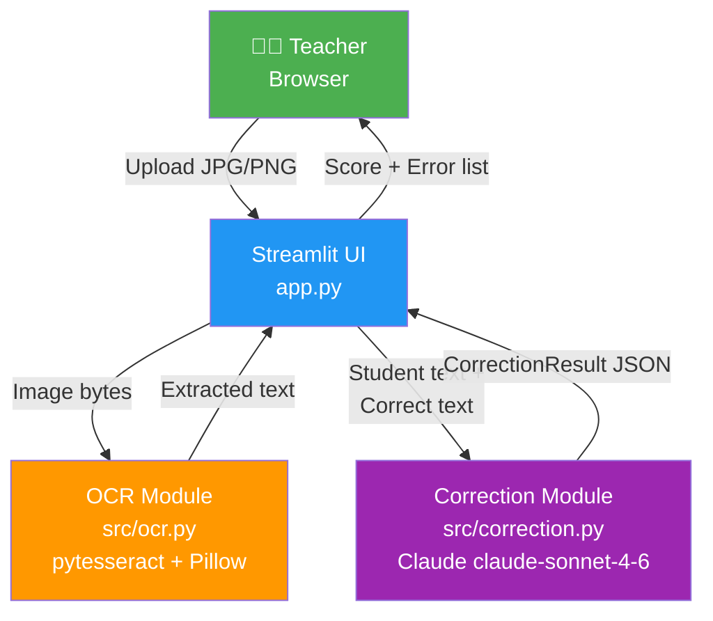
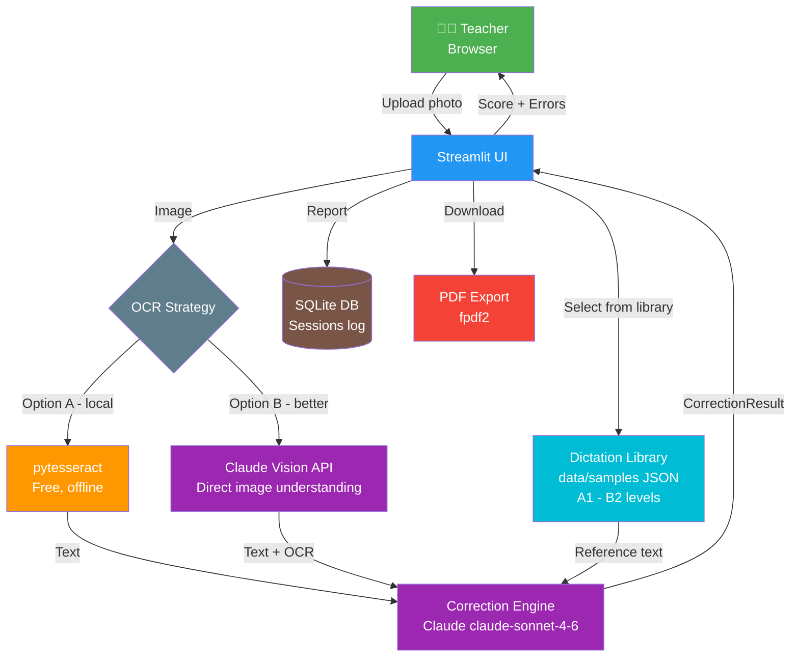
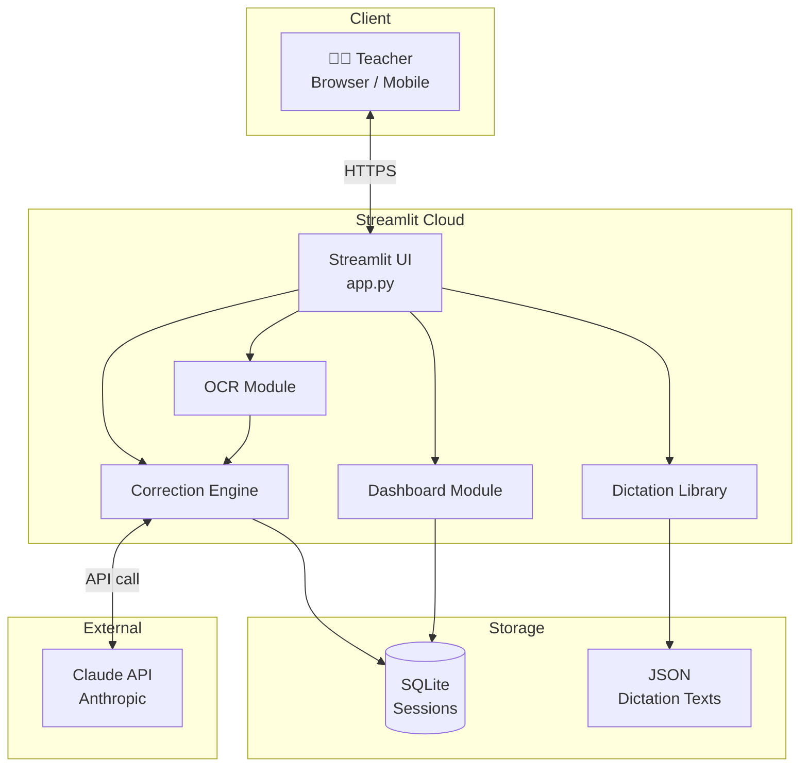
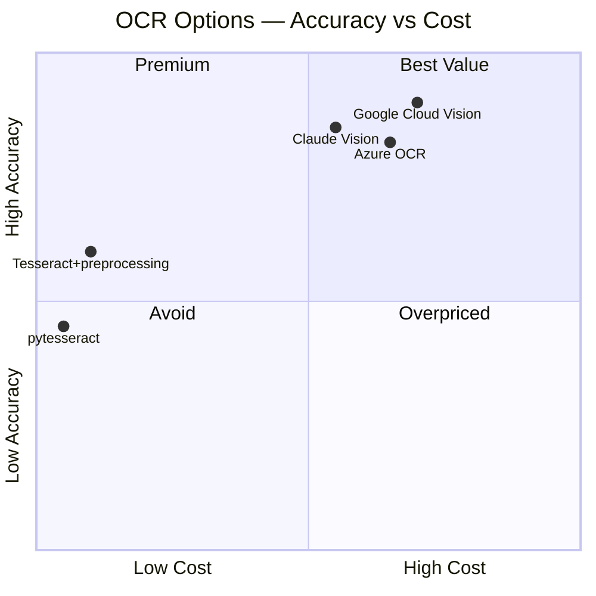
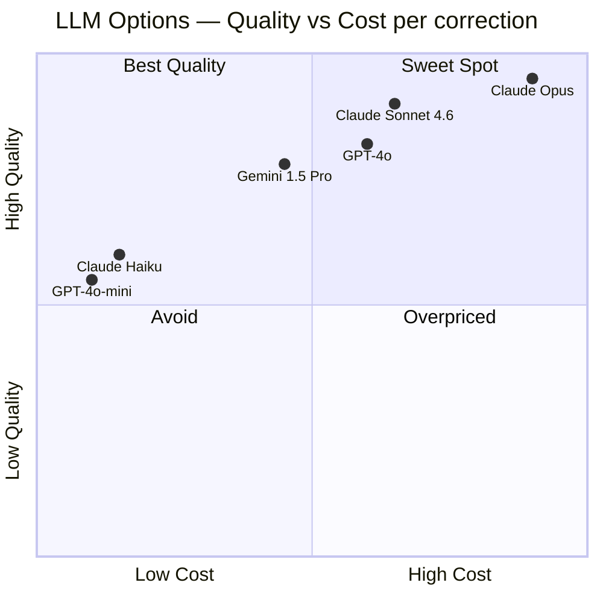
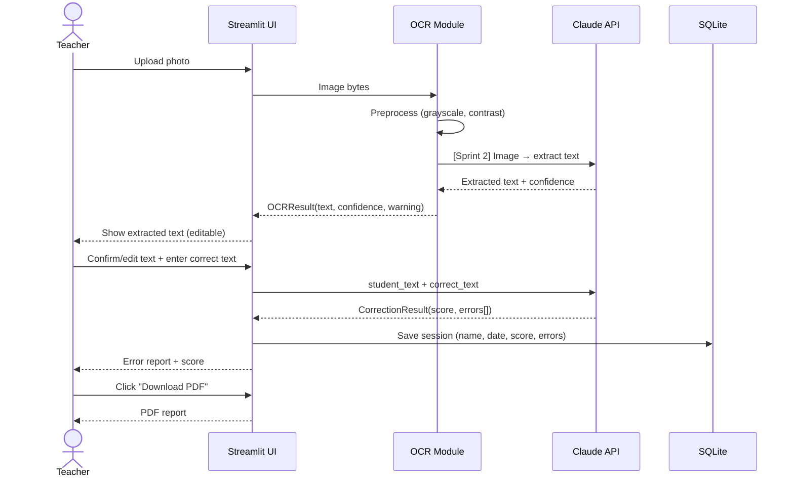
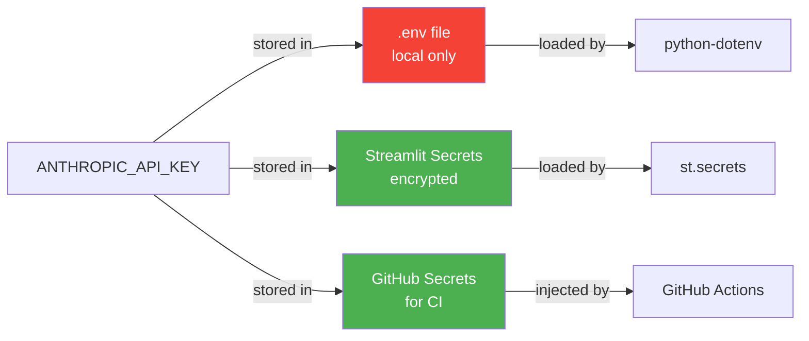
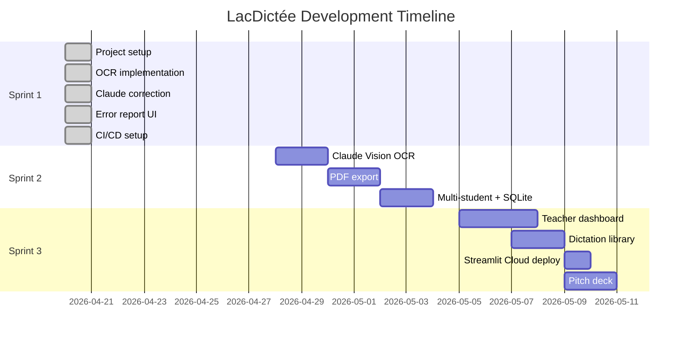

# High Level Design — LacDictée

**Version:** 1.0  
**Date:** 2026-04-20  
**Author:** Ibrahim Ulucan

---

## 1. System Overview

LacDictée automates French dictation correction for teachers. The teacher uploads a photo of a student's handwritten dictation — the system reads it, compares it to the correct text using AI, and produces an instant structured error report.

---

## 2. Current Architecture — Sprint 1 (MVP)

**Flow:**
1. Teacher uploads handwritten dictation photo
2. pytesseract extracts text (French lang pack `fra`)
3. Teacher reviews/corrects OCR output
4. Teacher enters the reference correct text
5. Claude compares both → structured JSON error report
6. UI renders: score, error list with type + explanation

---

## 3. Proposed Architecture — Sprint 2+ (Enhanced)

---

## 4. Future Architecture — Sprint 3 (Dashboard + Deployment)

---

## 5. OCR Strategy Decision

### Why Claude Vision is better than pytesseract for handwriting

| Model | Handwriting | French Accents | Cost | Setup |
|-------|-------------|---------------|------|-------|
| **pytesseract** (current) | ⚠️ Mediocre | ⚠️ Needs `fra` pack | Free | System install |
| **Claude Vision** (proposed) | ✅ Excellent | ✅ Native | ~$0.003/image | Already integrated |
| **Google Cloud Vision** | ✅ Best | ✅ Good | ~$1.50/1000 img | New API key |
| **Azure OCR** | ✅ Excellent | ✅ Good | ~$1/1000 img | New API key |

**Decision:** Migrate from pytesseract → **Claude Vision** in Sprint 2.

**Why:**
- Already paying for Claude API — no extra cost
- No system dependency (no `brew install tesseract`)
- Dramatically better handwriting recognition
- Handles French accents natively
- Simplifies CI (no tesseract-ocr-fra in GitHub Actions)

---

## 6. LLM Strategy Decision

| Model | French Quality | Structured JSON | Cost/correction | Decision |
|-------|---------------|-----------------|-----------------|----------|
| **Claude claude-sonnet-4-6** | ✅ Excellent | ✅ Reliable | ~$0.003 | ✅ **Selected** |
| GPT-4o | ✅ Excellent | ✅ Reliable | ~$0.003 | Comparable, extra key |
| Claude Haiku 4.5 | ✅ Good | ✅ Good | ~$0.0005 | Fallback option |
| GPT-4o-mini | ⚠️ Good | ⚠️ OK | ~$0.0002 | Demo risk |
| Gemini 1.5 Pro | ✅ Good | ✅ Good | ~$0.002 | No advantage here |

**Decision: Claude claude-sonnet-4-6**

**Why not GPT-4o:**
- Already integrated with Claude
- No second API key to manage
- Claude is better at structured JSON output
- Prompt caching available (cheaper for repeated system prompts)

**Why not Haiku:**
- Demo quality matters — explanations must be clear for teachers
- Score difference visible in error explanations

---

## 7. Data Flow Detail

---

## 8. Security Model

**Rules:**
- `.env` never committed (`.gitignore`)
- No API keys in source code
- Student photos not persisted (processed in memory)
- Student names optional (privacy)

---

## 9. Sprint Milestones

